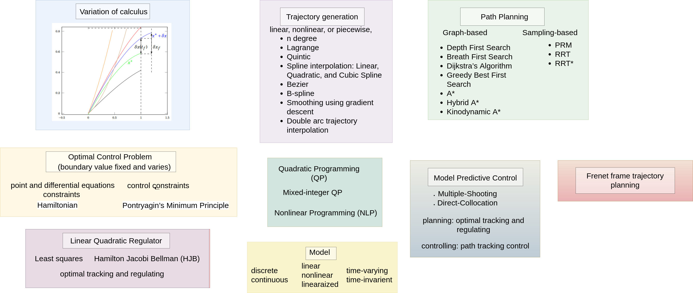

# Motion Planning for Autonomous Vehicles 
## Course Structure :space_invader:

  

- Introduction [:books:](lectures/mpav_introduction.pdf) 

- Introduction to Optimization [:books:](lectures/mpav_introduction_to_optimization.pdf)
		<ul>
			<li>Constrained optimization</li>
            <li>Least squares fitting</li>
            <li>Least squares fitting with regularization</li>
            <li>Smoothing</li>
            <li>Penalty functions</li>
            <li>Robust estimation</li>
            <li>Feasible problems</li>
            <li>Quadratic problems</li>
            <li>Linear problems</li>
		</ul>
- Variation of Calculus [:books:](lectures/mpav_variation_of_calculas.pdf) 
	 	<ul>
	      <li>Extremum
          <li>  Convexity</li>
           <li> Linearization of function up to the second variation</li>
          <li>  Incremental of a function</li>
          <li>  Incremental of a functional</li>
          <li>  Fixed value problem</li>
          <li>  Free terminal point problem</li>
           <li> Fix point problem ( t f is fixed and x(t f ) is free)</li>
          <li>  Fix point problem ( t f is free and x(t f ) is fixed)</li>
          <li>  Free endpoint problem: if t f and x(t f ) are uncorrelated</li>
          <li>  Free endpoint problem: if t f and x(t f ) are depended on each other</li>
	    </ul>

- Hamiltonian (Optimal control theory)[:books:](lectures/mpav_hamiltonian_optimal_control_theory.pdf)
		<ul>
			<li> Constrained Minimization of functions </li>
            <ul>
			    <li> Elimination method (direct method) </li>
                <li> The Lagrange multiplier method: examples general formulation </li>
            </ul>
            <li> Constrained Minimization of functional: Point constraints,
            differential equation constraints  </li>
            <li> Hamiltonian  </li>
            <li> The necessary condition for optimal control  </li>
            <li> Boundary conditions for optimal control: with the fixed final 
            time and the final state specified or free  </li>
            <li> Boundary conditions for optimal control: with the free final
            time and the final state specified, free, lies on the moving
            point x f = θ (t f ) , or lies on a moving surface m(x(t)) )  </li>
        </ul>

- Pontryagin’s Minimum Principle [:books: ](lectures/mpav_pontryagin_s_optimal_control_theory.pdf)
		<ul>
			<li> Optimal control problem </li>
            <li> Pontryagin’s Minimum Principle </li>
            <li> Optimal boundary value problem </li>
            <li> Minimizing the square of the jerk </li>
            <li> Minimizing the square of acceleration </li>
		</ul>

- Linear Quadratic Regulator   [:books: ]
		<ul>
			<li> LQR Formulation </li>
            <li>    LQR via least squares </li>
            <li>    Hamilton Jacobi Bellman (HJB) Approach </li>
            <li>    Bellman Optimality </li>
            <li>    LQR with HJB </li>
            <li>    Hamiltonian formulation to find the optimal control policy </li>
            <li>    Linear quadratic optimal tracking </li>
            <li>    Optimal reference trajectory tracking with LQR </li>
		</ul>
	
- Model Predictive Control (MPC) [:books: ]
		<ul>
			<li> Ways to solve Optimal Control (OCP) Problems </li>
            <li> OCP Using Nonlinear Programming Problem (NLP) </li>
            <li> Model Predictive Control: Prediction model, Constraints </li>
            <li> Reference trajectory tracking </li>
            <li> Simplified Motion Model </li>
            <li> With Multiple Shooting and direct collocation </li>
            <li> Continuous nonlinear system linearization </li>
            <li> Discrete-time nonlinear system linearization </li>
            <li> Linear Time-Varying Model Predictive Control
            <li> Path tracking control </li>
            <li> Path tracking control with MPC: kinematic model, trajectory 
            generation, dynamic model, and cost, formulation </li>
		</ul>

- Path planning   [:books: ] 
		<ul>
			<li> Configuration Space vs Search Space for Robot  </li>
            <li> Path Planning Problem Formulation  </li>
            <li> Search-based Planning: Mapping  </li>
            <li> Search-based Planning: Graph  </li>
            <li> Graph Searching  </li>
            <ul>
                <li> Depth First Search </li>
                <li> Breath First Search </li>
                <li> Cost Consideration </li>
                <li> Dijkstra’s Algorithm </li>
                <li> Greedy Best First Search </li>
                <li> A*: Combination of Greedy Best First Search and Dijkstra’s
                Algorithm </li>
                <li> A*: Design Consideration </li>
                <li> Graph-based search problem classification </li>
                <li> KinoDynamic A*:Heuristics, Generating motion primitives,
                finding neighbors </li>
                <li> Hybrid A*: Motion model, finding neighbors, cost to go h, and
                cost so far g </li>
            </ul>
            <li> Sampling-based path planning  </li>
             <ul>
               <li> Probabilistic Road Map (PRM) </li>
                <li> Rapidly-exploring Random Tree (RRT) </li>
                <li> Rapidly-exploring Random Tree* (RRT*) </li>
                <li> Pros and Cons of RRT and RRT* </li>
             </ul>
		</ul>

- Curve Fitting [:books:]
		<ul>
			<li>n degree polynomial fitting  </li>
            <li>    Euler–Lagrange equation  </li>
            <li>    Minimum jerk trajectory (MJT) generation  </li>
            <li>    Quintic polynomial  </li>
            <li>    Lagrange polynomials  </li>
            <li>    Lagrange first-order, second-order, and nth-order interpolation </li>
             <li>   Spline interpolation: Linear, Quadratic, and Cubic Spline </li>
             <li>   Other types of curve fitting: Gradient descent, Double arc trajectory interpolation </li>
            <li>    Nonlinear curve fitting </li>
              <li>  Bezier curve fitting </li>
              <li>  B-spline curve fitting </li>
              <li> Minimum-snap curve fitting </li> 
		</ul>
- Frenet frame trajectory planning [:books:]
	<ul>
		<li>Frenet frame </li>
        <li> Curve parameterization of the reference trajectory</li>
        <li> Estimate the position of a given Spline </li>
        <li> The road-aligned coordinate system with a nonlinear
        dynamic bicycle model </li>
        <li> Frenet frame trajectory tracking using a nonlinear bicycle
        model </li>
        <li> Transformations from Frenet coordinates to global
        coordinates </li>
        <li> Polynomial motion planning </li>
        <li> Frenet frame trajectory generation algorithm </li>
        <li> Calculate global trajectories </li>
	</ul>
- Timed Elastic Band [:books:]
    <ul>
        <li> Elastic band and time elastic band </li>
        <li> Way points and obstacles: polynomial approximation of constraints</li>
        <li> Estimate the position of a given Spline </li>
        <li> Velocity and acceleration generation </li>
        <li> Non-holonomic kinematics  </li>
    </ul>  
- Gradient-based online trajectory generation [:books:]
    <ul>
        <li> Piecewise polynomial trajectory generation </li>
        <li> Formulation of the objective function </li>
        <li> The cost of the smoothness  </li>
        <li> The cost of the clearance </li>
        <li> The cost of the dynamic feasibility  </li>
    </ul>  

# References 
[1]. Werling, M., Ziegler, J., Kammel, S., & Thrun, S. (2010, May). Optimal trajectory generation for dynamic street scenarios in a frenet frame. In 2010 IEEE International Conference on Robotics and Automation (pp. 987-993). IEEE.

[2]. Mueller, M. W., Hehn, M., & D'Andrea, R. (2015). A computationally efficient motion primitive for quadrocopter trajectory generation. IEEE transactions on robotics, 31(6), 1294-1310.

[3]. Takahashi, A., Hongo, T., Ninomiya, Y., & Sugimoto, G. (1989, September). Local path planning and motion control for agv in positioning. In Proceedings. IEEE/RSJ International Workshop on Intelligent Robots and Systems'.(IROS'89)'The Autonomous Mobile Robots and Its Applications (pp. 392-397). IEEE.

[4]. Frolkovič, P. (1990). Numerical recipes: The art of scientific computing.

[5]. Lima, P. F., Mårtensson, J., & Wahlberg, B. (2017, December). Stability conditions for linear time-varying model predictive control in autonomous driving. In 2017 IEEE 56th Annual Conference on Decision and Control (CDC) (pp. 2775-2782). IEEE.

[6]. Lima, P. F., Oliveira, R., Mårtensson, J., & Wahlberg, B. (2017, October). Minimizing long vehicles overhang exceeding the drivable surface via convex path optimization. In 2017 IEEE 20th International Conference on Intelligent Transportation Systems (ITSC) (pp. 1-8). IEEE.

[7]. Kulathunga, G., Devitt, D., Fedorenko, R., & Klimchik, A. (2021). Path planning followed by kinodynamic smoothing for multirotor aerial vehicles (mavs). Russian Journal of Nonlinear Dynamics, 17(4), 491-505.

[8]. Kulathunga, G., Devitt, D., & Klimchik, A. (2022). Trajectory tracking for quadrotors: An optimization‐based planning followed by controlling approach. Journal of Field Robotics, 39(7), 1001-1011.

[9]. Kulathunga, G., Hamed, H., Devitt, D., & Klimchik, A. (2022). Optimization-Based Trajectory Tracking Approach for Multi-Rotor Aerial Vehicles in Unknown Environments. IEEE Robotics and Automation Letters, 7(2), 4598-4605.

[10]. Robust and Efficient Quadrotor Trajectory Generation for Fast Autonomous Flight, Boyu Zhou, Fei Gao, Luqi Wang, Chuhao Liu and Shaojie Shen, IEEE Robotics and Automation Letters (RA-L), 2019.

[11]. https://web.casadi.org/

[12]. https://www.cvxpy.org/ 

[13]. https://osqp.org/ 

[14]. Kulathunga, G., & Klimchik, A. (2022). Optimization-based Motion Planning for Multirotor Aerial Vehicles: a Review. arXiv preprint arXiv:2208.14647.

[15]. Mellinger D, Kumar V. Minimum snap trajectory generation and control for quadrotors[C]//Robotics and Automation (ICRA), 2011 IEEE International Conference on. IEEE, 2011: 2520-2525.

[16]. Polynomial Trajectory Planning for Aggressive Quadrotor Flight in Dense Indoor Environments, Charles Richter, Adam Bry, and Nicholas Roy

[17]. Rösmann, C., Feiten, W., Wösch, T., Hoffmann, F.,  Bertram, T. (2012, May). Trajectory modification considering dynamic constraints of autonomous robots. In ROBOTIK 2012; 7th German Conference on Robotics (pp. 1-6). VDE.

[18]. Rösmann, C., Hoffmann, F., & Bertram, T. (2017). Integrated online trajectory planning and optimization in distinctive topologies. Robotics and Autonomous Systems, 88, 142-153.

[19]. Gao, F., Lin, Y.,  Shen, S. (2017, September). Gradient-based online safe trajectory generation for quadrotor flight in complex environments. In 2017 IEEE/RSJ international conference on intelligent robots and systems (IROS) (pp. 3681-3688). IEEE. 