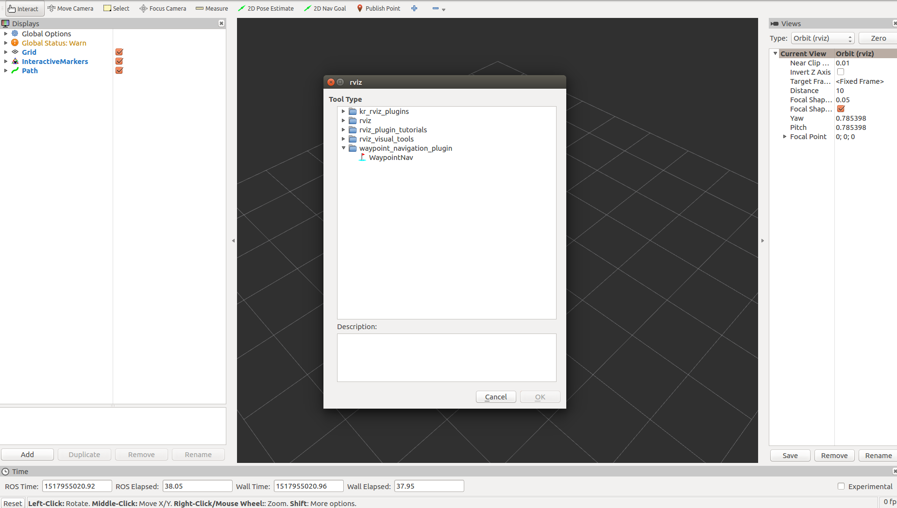
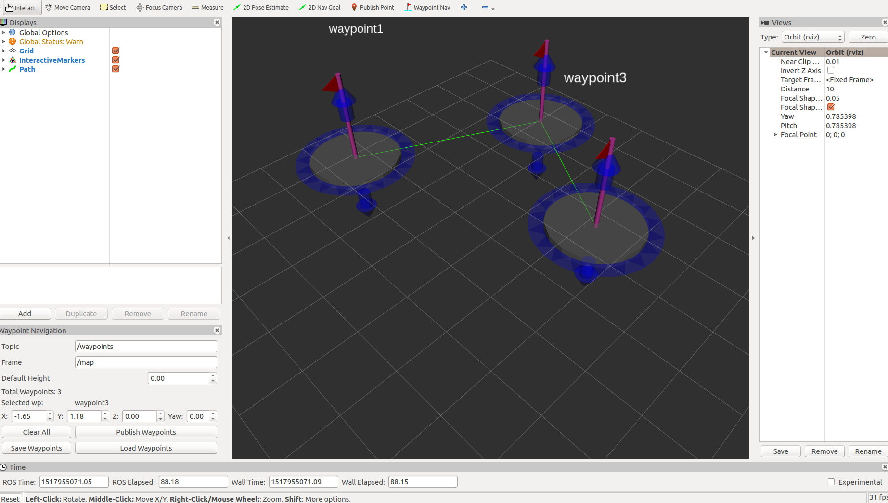

# waypoint_navigation_plugin

For testing
```
roslaunch waypoint_navigation_plugin rviz.launch
```

Add the WaypointNav Tool from waypoint_navigation_plugin



Click on the tool to add multiple waypoints and drop onto RviZ scene. The locations can be updated by dragging the Interactive marker of by using the Rviz panel


Clicking "Publish Waypoints" on the panel publishes nav_msgs::Path on topic entered under "Topic"
